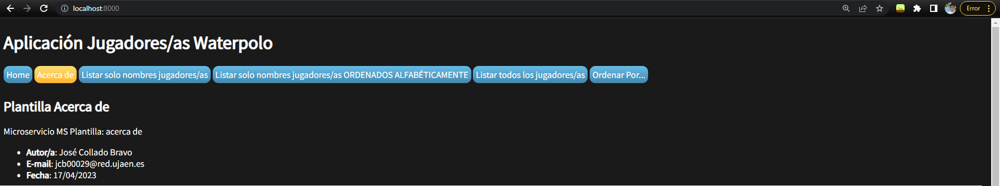

# Práctica 3
## José Collado Bravo


Alumno de la asignatura Desarrollo Ágil en la Universidad de Jaén.
* **Correo**: jcb00029@red.ujaen.es
* **GitHub**: https://github.com/josecolladobravo
* **Trello**: https://trello.com/b/Q49PGNxW/pr%C3%A1ctica-3

## Capturas de pantalla y documentos de la base de datos en Fauna
 
 **Home Fauna**


**Base de datos**


**Documentos creados**


### Documento 1

```
{
  "ref": Ref(Collection("jugadores"), "359977783521182297"),
  "ts": 1679561740355000,
  "data": {
    "nombre": "Manel",
    "apellidos": "Estiarte Duocastella",
    "fec_nac": {
      "dia": 26,
      "mes": 10,
      "anio": 1961
    },
    "competiciones": [
      1980,
      1984,
      1986
    ],
    "nacionalidad": "España",
    "peso": 62,
    "posicion": "Atacante"
  }
}
```
### Documento 2
```
{
  "ref": Ref(Collection("jugadores"), "359978300000436826"),
  "ts": 1679561766600000,
  "data": {
    "nombre": "Gianni",
    "apellidos": "De Magistris",
    "fec_nac": {
      "dia": 3,
      "mes": 12,
      "anio": 1950
    },
    "competiciones": [
      1970,
      1978,
      1982
    ],
    "nacionalidad": "Italia",
    "peso": 82,
    "posicion": "Atacante"
  }
}
```
### Documento 3
```
{
  "ref": Ref(Collection("jugadores"), "359978300000436826"),
  "ts": 1679561766600000,
  "data": {
    "nombre": "Gianni",
    "apellidos": "De Magistris",
    "fec_nac": {
      "dia": 3,
      "mes": 12,
      "anio": 1950
    },
    "competiciones": [
      1970,
      1978,
      1982
    ],
    "nacionalidad": "Italia",
    "peso": 82,
    "posicion": "Atacante"
  }
}
```
### Documento 4
```
{
  "ref": Ref(Collection("jugadores"), "359978605287047769"),
  "ts": 1679561817555000,
  "data": {
    "nombre": "Jesús Miguel",
    "apellidos": "Rollán Prada",
    "fec_nac": {
      "dia": 4,
      "mes": 4,
      "anio": 1968
    },
    "competiciones": [
      1990,
      1994,
      1995
    ],
    "nacionalidad": "España",
    "peso": 74,
    "posicion": "Medio"
  }
}
```
### Documento 5
```
{
  "ref": Ref(Collection("jugadores"), "359978755935961690"),
  "ts": 1679561916700000,
  "data": {
    "nombre": "Laura",
    "apellidos": "Ester Ramos",
    "fec_nac": {
      "dia": 22,
      "mes": 1,
      "anio": 1990
    },
    "competiciones": [
      2010,
      2014,
      2015
    ],
    "nacionalidad": "España",
    "peso": 58,
    "posicion": "Guardameta"
  }
}
```
### Documento 6
```
{
  "ref": Ref(Collection("jugadores"), "359978838740959833"),
  "ts": 1679561943230000,
  "data": {
    "nombre": "Elena",
    "apellidos": "Ruiz Barril",
    "fec_nac": {
      "dia": 29,
      "mes": 10,
      "anio": 2004
    },
    "competiciones": [
      2021,
      2022
    ],
    "nacionalidad": "España",
    "peso": 62,
    "posicion": "Atacante"
  }
}
```
### Documento 7
```
{
  "ref": Ref(Collection("jugadores"), "359978975237243481"),
  "ts": 1679561978470000,
  "data": {
    "nombre": "Beatriz",
    "apellidos": "Ortiz Muñoz",
    "fec_nac": {
      "dia": 21,
      "mes": 6,
      "anio": 1995
    },
    "competiciones": [
      2015,
      2016,
      2018
    ],
    "nacionalidad": "España",
    "peso": 65,
    "posicion": "Medio"
  }
}
```
### Documento 8
```
{
  "ref": Ref(Collection("jugadores"), "359979590745064026"),
  "ts": 1679562223087000,
  "data": {
    "nombre": "Anni",
    "apellidos": "Espar Llaquet",
    "fec_nac": {
      "dia": 8,
      "mes": 1,
      "anio": 1993
    },
    "competiciones": [
      2010,
      2014,
      2018
    ],
    "nacionalidad": "España",
    "peso": 67,
    "posicion": "Defensa"
  }
}
```
### Documento 9
```
{
  "ref": Ref(Collection("jugadores"), "359979777749156441"),
  "ts": 1679562318460000,
  "data": {
    "nombre": "Xavier",
    "apellidos": "Garcia Gadea",
    "fec_nac": {
      "dia": 5,
      "mes": 1,
      "anio": 1984
    },
    "competiciones": [
      2005,
      2010,
      2014
    ],
    "nacionalidad": "España",
    "peso": 95,
    "posicion": "Guardameta"
  }
}
```
### Documento 10
```
{
  "ref": Ref(Collection("jugadores"), "359979893055816282"),
  "ts": 1679562476890000,
  "data": {
    "nombre": "Alberto",
    "apellidos": "Barroso Macarro",
    "fec_nac": {
      "dia": 8,
      "mes": 7,
      "anio": 1994
    },
    "competiciones": [
      2015,
      2016,
      2018
    ],
    "nacionalidad": "España",
    "peso": 95,
    "posicion": "Defensa"
  }
}
```
### Documento 11
```
{
  "ref": Ref(Collection("jugadores"), "359980025552831066"),
  "ts": 1679562554790000,
  "data": {
    "nombre": "Guillermo",
    "apellidos": "Molina Ríos",
    "fec_nac": {
      "dia": 16,
      "mes": 3,
      "anio": 1984
    },
    "competiciones": [
      2004,
      2008,
      2012
    ],
    "nacionalidad": "España",
    "peso": 115,
    "posicion": "Atacante"
  }
}
```
### Documento 12
```
{
  "ref": Ref(Collection("jugadores"), "359980127507972697"),
  "ts": 1679562652030000,
  "data": {
    "nombre": "Maica",
    "apellidos": "García Godoy",
    "fec_nac": {
      "dia": 17,
      "mes": 10,
      "anio": 1990
    },
    "competiciones": [
      2015,
      2019,
      2022
    ],
    "nacionalidad": "España",
    "peso": 89,
    "posicion": "Guardameta"
  }
}
```
# Incrementos

A partir de aquí, iré poniendo todos los detalles de cada incremento e historia de usuario que he ido desarrollando en el proyecto. 

## Incremento 1

Para este primer incremento, he seleccionado las H.U de la 1 a la 5.


Y a continuación voy a mostrar cada historia de usuario por dentro con su descripción y criterios de aceptación.

### Historia de usuario 1


### Historia de usuario 2


### Historia de usuario 3


### Historia de usuario 4


### Historia de usuario 5


Estas son las cinco historias de usuario que he seleccionado para el primer incremento. 

Una vez hechas, el trello queda así: 

### Foto Trello 1


### Foto Trello 2


Las historias de usuario seleccionadas para este primer incremento se han quedado así:

### H.U 1
1. Ver la información del autor/autora de la aplicación al pulsar en el botón “Acerca de”. VALOR: 0,1



### H.U 2
2. Ver un listado solo con los nombres de todos los jugadores/equipos. VALOR: 0,2


### H.U 3
3. Ver un listado solo con los nombres de todos los jugadores/equipos ordenados alfabéticamente. VALOR: 0,3


### H.U 4
4. Ver un listado con todos los datos de todos los jugadores/equipos. VALOR: 0,4


### H.U 5
5. Ver un listado con todos los datos de todos los jugadores/equipos ordenado por el campo del jugador/equipo que el usuario desee. VALOR: 0,5


Formulario donde el usuario puede elegir por qué campo quiere ordenar los/as jugadores/as:


Ordenar por Fecha de Nacimiento:


Y hasta aquí el primer incremento. Vamos con el segundo.